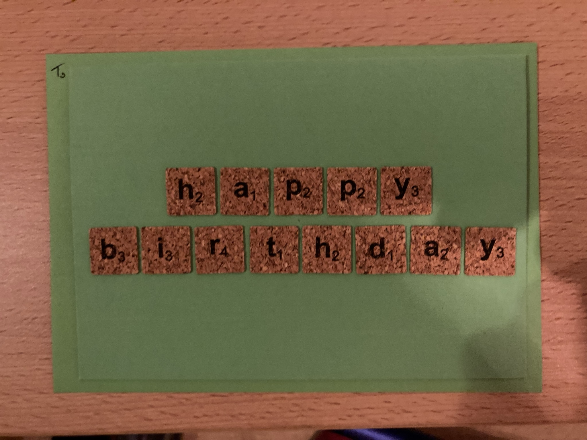
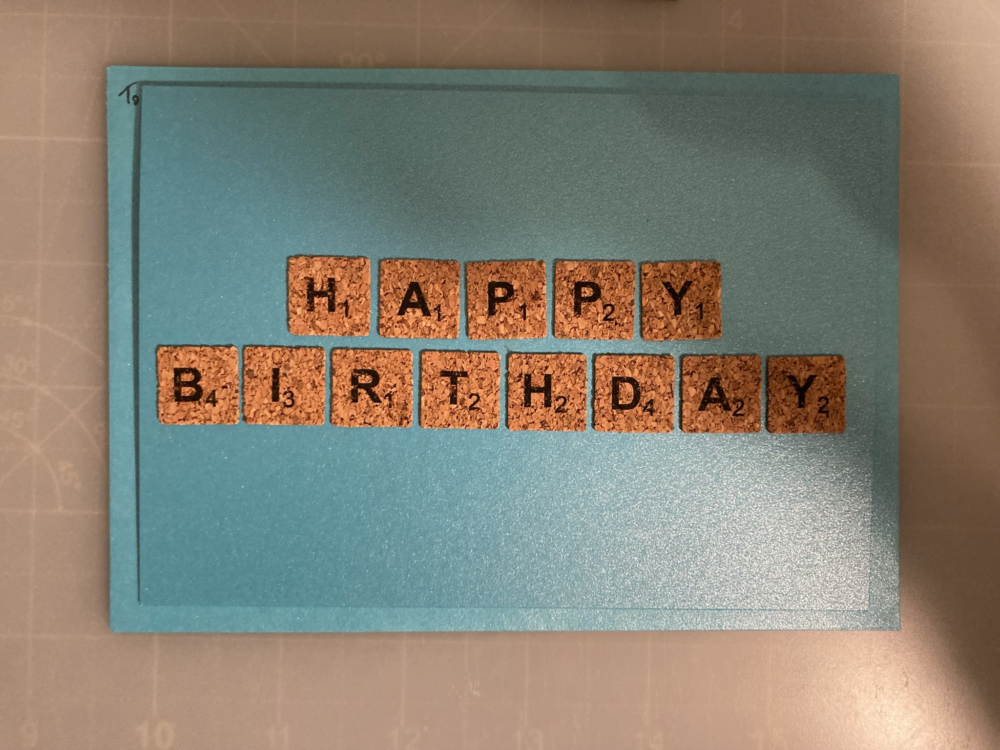

# Birthday Card

## Supplies

- Brown card
- Brown paper
- Scrabble tiles stickers
- Foam squares
- Black pen

- Green card
- Blue card

## Steps

Cut out rectangle

Stick to card with foam squares

Add tiles to spell happy birthday

Write card

## Outcome

<!-- ### Stages -->

<!--  -->

## Approx Cost

- ?

<!-- ## Inspired -->
