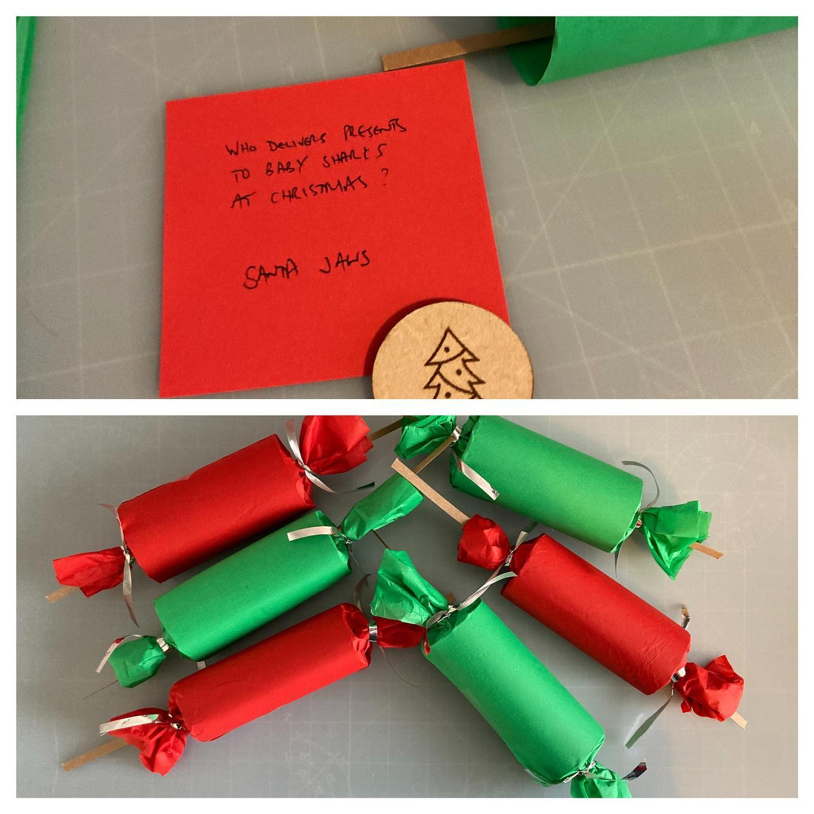

# Christmas Crackers

## Supplies

- Loo roll tubes
- Craft paper
- ribbon

## Steps

Use up toilet roll :p

Pictures for the engraving on the wooden discs

- Christmas Tree
- Snowman
- Snowflake

### Jokes

What do you get if you cross Santa with a duck?
> A Christmas quacker

Who delivers presents to baby sharks at Christmas?
> Santa Jaws

What do Santa's little helpers learn at school?
> The elf-abet

Why did the turkey join the band?
> Because it had the drumsticks

What do snowmen wear on their heads?
> Ice caps

Who hides in the bakery at Christmas?
> A mince spy

[The 50 best Christmas cracker jokes for 2021](https://www.telegraph.co.uk/christmas/0/50-best-christmas-cracker-jokes-2021/)

## Outcome

<!-- ### Stages -->

<!--  -->

## Approx Cost

- ?

<!-- ## Inspired
-  -->
